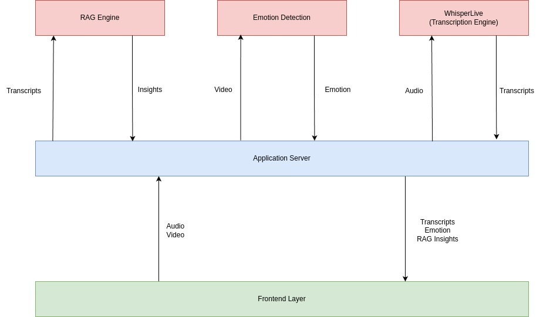
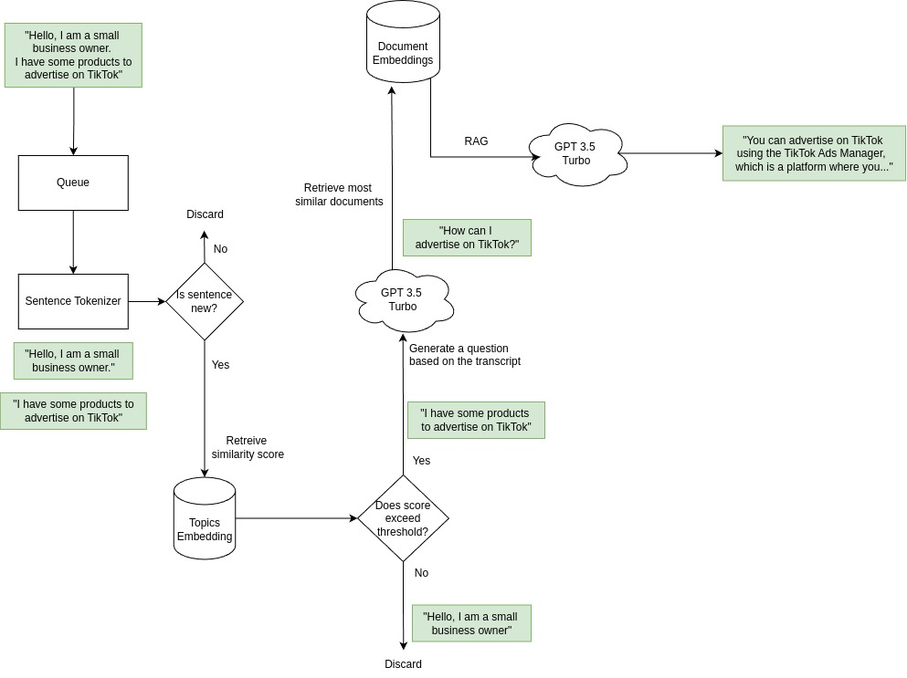

# TikTok Sales Helper

Originally a project submitted for TikTok Techjam 2024, I continued the development of the project and added more features.

Original project [here](https://github.com/joseyjh/sales-helper-hackathon), which was built on top of [WhisperLive](https://github.com/collabora/WhisperLive), a nearly-live implementation of OpenAI's Whisper.

## Demo

VIDEO HERE

## Project Overview

This video calling web application aids sales representatives by providing real-time, accurate data about their services and leveraging AI to optimize sales strategies. It integrates live video conferencing, emotion detection, and automatic information retrieval to enhance the efficiency and effectiveness of sales interactions.

### Features

- 📹 Live Video Conferencing
  - Implemented using [getstream.io](https://getstream.io)
- 😊 Emotion Detection
  - Trained a Random Forest Classification algorithm from scratch using a [synthesized facial dataset](https://osf.io/7a5fs/). Facial landmarks were generated using [Mediapipe](https://github.com/google-ai-edge/mediapipe) and fed into the model. For inference, a frame of the video is sent at a fixed interval to the model for emotion detection.
- 📝 Real-Time Transcription
  - Implemented using [WhisperLive](https://github.com/collabora/WhisperLive)
- 🔍 Live Automatic Information Retrieval
  - Implemented using [ChromaDB](https://www.trychroma.com/), more details in the implementation section

### Technologies

The project was created with:

- Frontend

  - React
  - Vite
  - Tailwind CSS
  - [getstream.io](https://getstream.io)
  - [socket.io](https://socket.io)

- Application Server
  - Flask
  - WebSockets
  - [ChromaDB](https://www.trychroma.com/)
  - OpenAI
  - OpenCV

## Getting Started

Run the following commands to run this application on your local machine.

### Clone this Respository

```bash
git clone https://github.com/martinng01/sales-helper.git
```

### Setting Up the Environment

Set up the Anaconda environment with **Python 3.11.9**

```bash
conda create -n sales-helper python==3.11.9
conda activate sales-helper
pip install -r requirements.txt
```

Install npm dependencies

```bash
cd react-video-call
npm install
```

### Running the Application

Run all 3 code blocks in **different** terminal windows from the base directory:

- Frontend

```bash
cd react-video-call
npm run dev
```

- Application Server

```bash
python middleware/middleware.py
```

- Transcription Server

```bash
python WhisperLive/run_server.py
```

Visit the localhost website in the frontend terminal window.

## Possible Improvements

- [ ] Enable audio and video to be received from the other client (Currently audio and video is received from user's side for proof of concept.)

## Implementation

### Architecture



### Retrieval Augmented Generation (RAG) Engine


